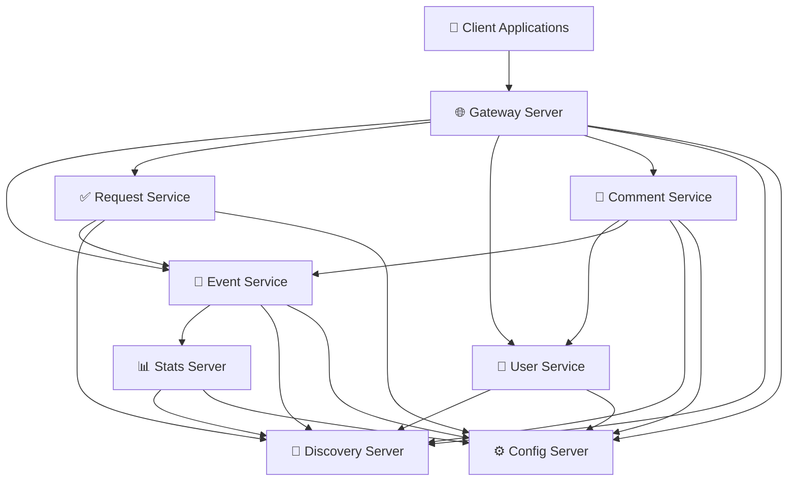

# 🚀 ExploreWithMe — Graduation Project

<div align="center">

## Платформа для организации и поиска совместных событий

Микросервисное приложение для публикации, поиска и управления мероприятиями.


</div>

---

## ✨ О проекте

**ExploreWithMe** — это сервис для поиска и организации совместного участия в событиях.

Платформа позволяет пользователям:

* 🎉 создавать собственные мероприятия;
* 🔍 искать события по категориям;
* 👥 собирать участников;
* ✅ управлять заявками на участие;
* 📊 анализировать популярность событий;
* 💬 взаимодействовать через комментарии;
* ⭐ получать персональные рекомендации.

Проект реализован в формате **микросервисной архитектуры** с четким разделением ответственности между сервисами.

Отдельный сервис статистики собирает информацию о просмотрах событий и обращениях к API, позволяя анализировать активность пользователей и популярность мероприятий.

---

# 🏗 Архитектура проекта

## Общая схема



---

# 🧩 Основные модули

## Core Services

| Сервис               | Назначение                                     |
| -------------------- | ---------------------------------------------- |
| 🎉 `event-service`   | Управление событиями, категориями и подборками |
| ✅ `request-service`  | Обработка заявок на участие                    |
| 👤 `user-service`    | Управление пользователями                      |
| 💬 `comment-service` | Работа с комментариями                         |

---

## Stats Service

| Сервис            | Назначение                                   |
| ----------------- | -------------------------------------------- |
| 📊 `stats-server` | Сбор статистики просмотров и обращений к API |

---

## Infrastructure

| Сервис                | Назначение                                  |
| --------------------- | ------------------------------------------- |
| 🌐 `gateway-server`   | Единая точка входа и маршрутизация запросов |
| 📡 `discovery-server` | Регистрация и обнаружение сервисов (Eureka) |
| ⚙️ `config-server`    | Централизованное хранение конфигурации      |

---

# 🔄 Взаимодействие сервисов

Взаимодействие построено на инфраструктуре **Spring Cloud**:

1. 📡 Все сервисы регистрируются в `discovery-server`
2. ⚙️ Конфигурации загружаются из `config-server`
3. 🌐 Внешние запросы поступают через `gateway-server`
4. 🔗 Сервисы взаимодействуют между собой по HTTP
5. 📊 `stats-server` собирает статистику просмотров событий

---

# ⚙️ Конфигурация сервисов

## Локальные конфигурации

```text
*/src/main/resources/application.yaml
```

## Централизованные конфигурации

```text
infra/config-server/src/main/resources/config
```

### Структура конфигураций

```text
infra/config-server/src/main/resources/config/
├── core/
│   ├── event-service
│   ├── request-service
│   ├── user-service
│   └── comment-service
│
├── stat/
│   └── stats-server
│
└── infra/
    └── gateway-server
```

---

# 🔌 Внутренний API

Внутреннее взаимодействие сервисов осуществляется через REST API.

## Основные сценарии взаимодействия

### 🎉 Event Service

* взаимодействует со `stats-server`
* сохраняет статистику просмотров
* получает аналитические данные

### ✅ Request Service

* проверяет состояние события
* контролирует лимиты участников
* управляет подтверждением заявок

### 💬 Comment Service

* валидирует пользователей
* проверяет доступность событий
* управляет комментариями

### 🌐 Gateway Server

* маршрутизирует запросы
* выполняет роль API Gateway
* обеспечивает единый вход в систему

---

# 🌍 Внешний API

## Спецификации OpenAPI

### Основной сервис

```text
/ewm-main-service-spec.json
```

### Сервис статистики

```text
/ewm-stats-service-spec.json
```

## Swagger Editor

Для просмотра спецификаций:

👉 [https://editor.swagger.io/](https://editor.swagger.io/)

---

# 🛠 Технологии

<div align="center">

| Backend       | Infrastructure | Database        | Tools   |
| ------------- | -------------- | --------------- | ------- |
| Java 21       | Spring Cloud   | PostgreSQL      | Maven   |
| Spring Boot 3 | Eureka         | JPA / Hibernate | Docker  |
| REST API      | Gateway        | SQL             | OpenAPI |

</div>

---

# 📦 Стек проекта

```text
Java 21
Spring Boot 3
Spring Cloud
Spring Data JPA
PostgreSQL
Docker / Docker Compose
Eureka Discovery Server
Spring Cloud Gateway
Spring Cloud Config Server
OpenAPI / Swagger
```

---

# 🚀 Возможности платформы

* 🔐 Публичное и приватное API
* 🛡 Административная модерация
* 📊 Система аналитики просмотров
* 🔎 Поиск и фильтрация мероприятий
* 👥 Управление участниками
* 💬 Комментарии и взаимодействие
* ☁️ Централизованная конфигурация
* ⚡ Масштабируемая микросервисная архитектура

---

# 📚 Архитектурные особенности

## Почему микросервисы?

Проект разделён на независимые сервисы для:

* масштабируемости;
* независимого деплоя;
* отказоустойчивости;
* удобной поддержки;
* разделения ответственности.

---

<div align="center">

## ⭐ ExploreWithMe

Платформа для совместных событий, построенная на современном стеке Java + Spring Cloud.

</div>
